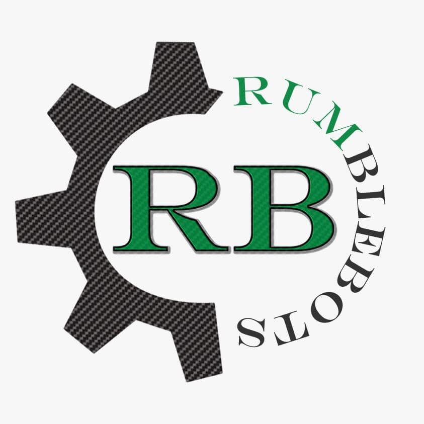
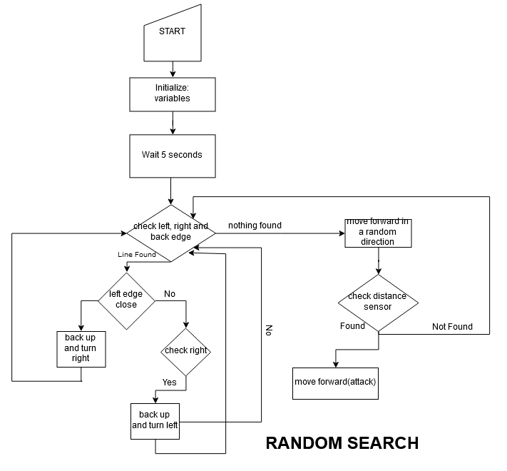
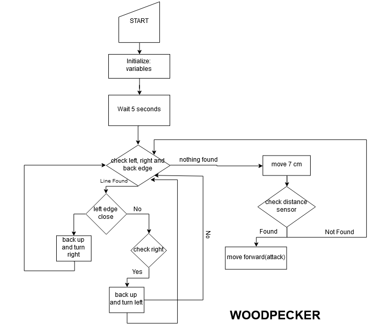
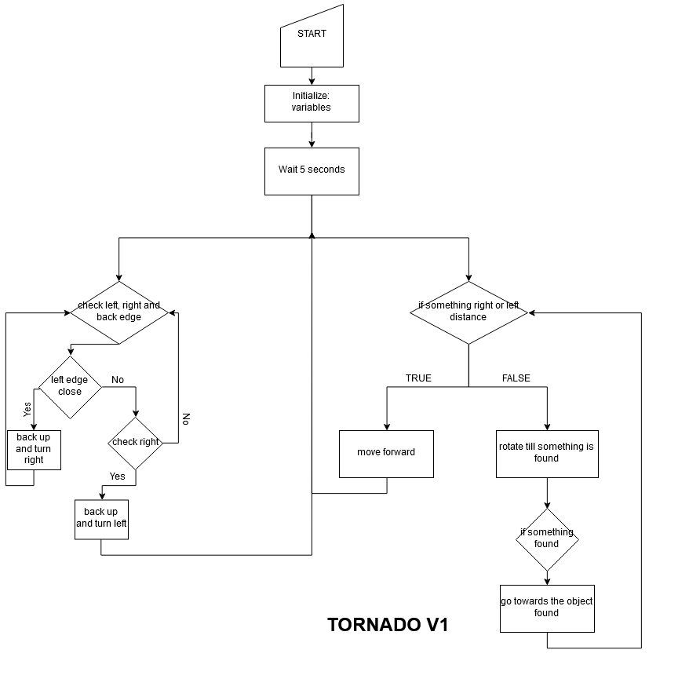
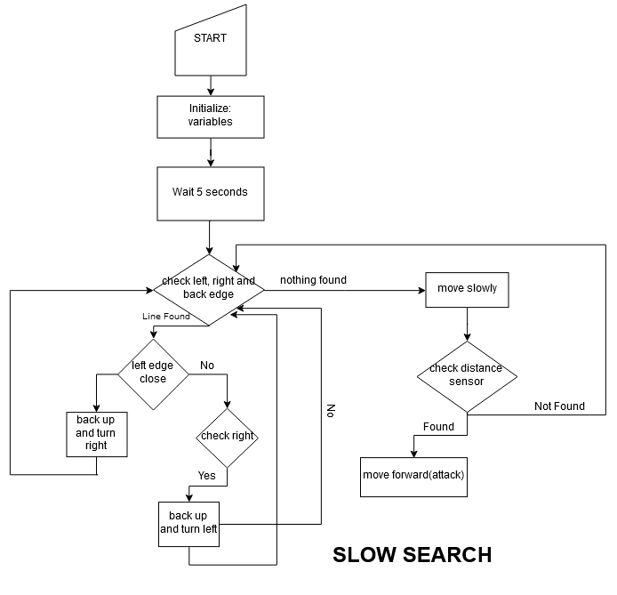
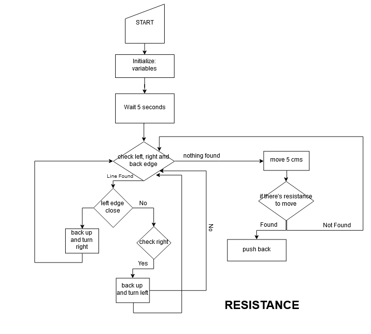
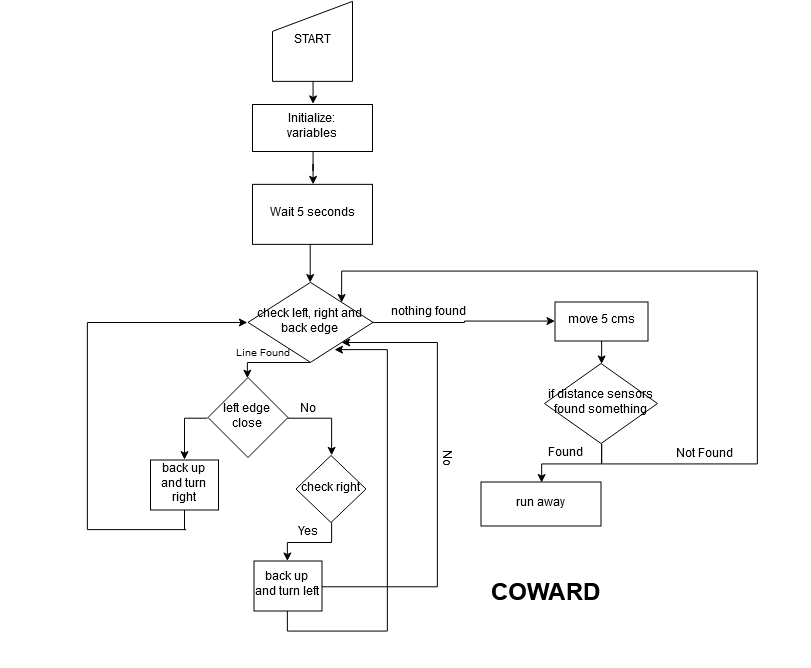
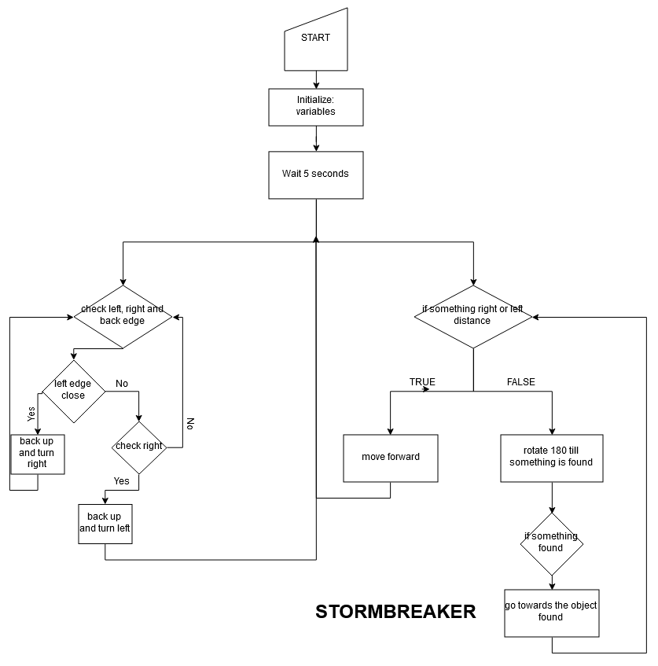
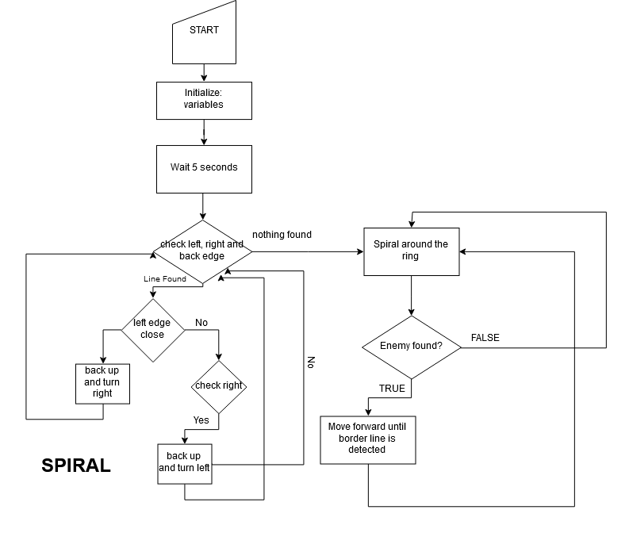
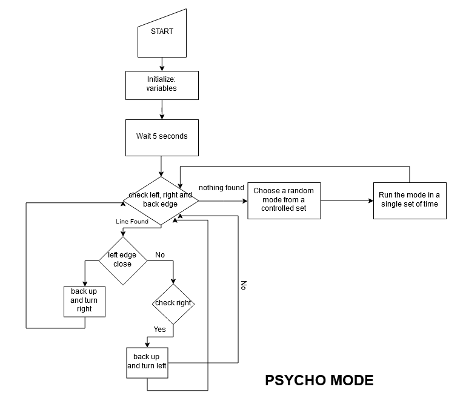

<h1 align="center">Rumblebots Software Team</h1>

## Members
  - Edimar
  - Amarilys
  - Jomar 
  - Paola
  - Jean P. I.
  
## To-Do List
  - [ ] Pre-programming phase
     - [ ] Create 8 or more Pseudocodes
     - [x] Create 8 or more Flowcharts
     - [x] Brainstorm new strategies
   
## Strategies for Mini Sumo 
   

   
   

  
  - [x] Pseudocode Created
  - [ ] Developed
   
   

   
   

   
  - [x] Pseudocode Created
  - [ ] Developed
  
   

   
   

  
  - [x] Pseudocode Created
  - [ ] Developed
  
   

   
   

  
  - [x] Pseudocode Created
  - [ ] Developed
  
  

   
   

  
  - [ ] Pseudocode Created
  - [ ] Developed
  
  

   
   

  
  - [x] Pseudocode Created
  - [ ] Developed
  
  

   
   

  
  - [x] Pseudocode Created
  - [ ] Developed
  
  

   
   

  
  - [ ] Pseudocode Created
  - [ ] Developed
  
  

   
   

  
  - [ ] Pseudocode Created
  - [ ] Developed
  
  

   
   

  
  - [ ] Pseudocode Created
  - [ ] Developed
